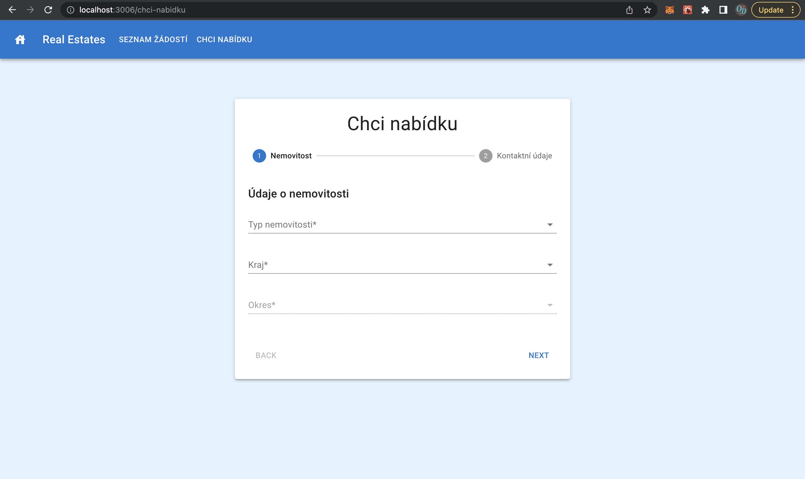

# Real Estates

The application provides a from to users for inquiring an offer for their real estate. On the index page all the inquires are listed.

## Application architecture and technologies

- Backend:
  - Written in Node.js with the help of Koa.js
  - MongoDB Community Server used as a database service
- Frontend:
  - Written in React
  - Styling is done with Material UI

## Requirements and running the application

To successfully run the application you need to have installed MongoDB Community Server on your device and the DB needs to be running and listening on "mongodb://localhost:27017/".
Both the frontend and the backend is running on localhost, the first on PORT: 3006, the second on PORT:8000
Check if you have Mongo installed:

        mongo --version

After cloning this repository, you have to install the dependencies for both backend and fronted.
To start the backend from the root directory run:

        cd server
        npm install
        nodemon index

Now you should see two log messages in tne console - "App is running" and "Connected to DB with mongoose"

In new console window, to start the frontend from the root directory run:

        cd client
        npm install
        npm start

Now you should see a log message in the console - "webpack compiled successfully

The application should be ready to use on: <http://127.0.0.1:3006/chci-nabidku>

The from design:

